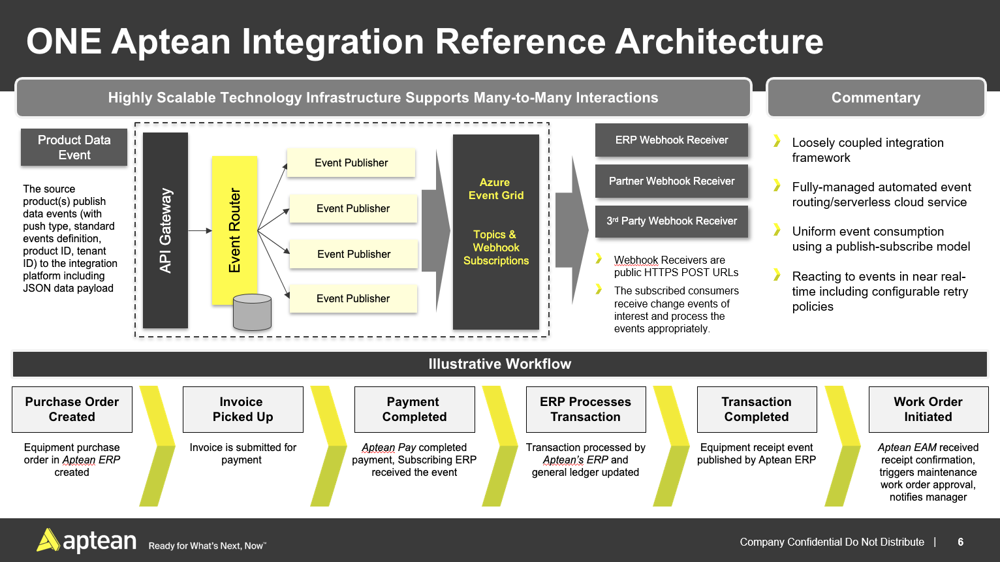

## Aptean Inegration Platform (AIP)
This document describes API helpers, Postman collection, etc.
## Reference Architecture

## API headers
API use requires subscribing to AIP platform. (These are provided by SRE team)
```
X-APTEAN-TENANT
X-APTEAN-APIM
X-APTEAN-PRODUCT
```
**API Documentation**: https://stg.integration-graph.apteansharedservices.com/swagger/index.html

**Producer - publish events**:

| **Tasks**                  | **API**                |
| :------------------------- | :--------------------- |
| Register event definitions | POST event-definitions |
| Publish event              | POST events            |
|                            |                        |

**Consumer**: (requires Webhook to receive events*)

| **Tasks**            | **API**        |
| :------------------- | :------------- |
| Register as consumer | POST consumers |
|                      |                |

**Playground**: You can use the Postman collection and environment setup json to invoke the APIs. Plugin the subscription info in the environment setup.

**Webhook receiver if you are consuming events**:
You can use the following endpoint as sample webhook reveiver https://stg.integration-consumer.apteansharedservices.com/v1/webhook/{{guid}} 
(substitute the GUID to create your own unique inbox). You can then view the events in https://stg.integration-consumer.apteansharedservices.com/inbox
Or use webhook.site which is publicly available site to quickly set up webhook endpoint.

For actual implementation you should create your own http service. See the following section for guidance.

For the http endpoint to be registered as Webhook receiver for AIP you can implement the following in the API controller. (You could also build a logic app/function app for a webhook receiver. More information is available in Microsoft sites for Event Grid)

```
using System;
using System.Collections.Generic;
using System.Linq;
using System.IO;
using System.Threading.Tasks;
using System.Net;
using System.Text;
using System.Net.Http;
using Newtonsoft.Json;
using Newtonsoft.Json.Linq;

namespace SampleReveiver
{
    [Route("api/[controller]")]
    public class WebhookController : Controller
    {
        [HttpPost]
        public async Task<IActionResult> Post()
        {
            using (var reader = new StreamReader(Request.Body, Encoding.UTF8))
            {
                var jsonContent = await reader.ReadToEndAsync();

                // Check the event type.
                // Return the validation code if it's 
                // a subscription validation request. 
                if (EventTypeSubcriptionValidation)
                {
                    return await HandleValidation(jsonContent);
                }
                else if (EventTypeNotification)
                {
                    //return await HandleGridEvents(jsonContent); -to do
                }            
                return BadRequest();                
            }
        }

        private bool EventTypeSubcriptionValidation
            => HttpContext.Request.Headers["aeg-event-type"].FirstOrDefault() ==
                "SubscriptionValidation";
        private bool EventTypeNotification
            => HttpContext.Request.Headers["aeg-event-type"].FirstOrDefault() ==
                "Notification";

        private async Task<JsonResult> HandleValidation(string jsonContent)
        {
            var gridEvent =
                JsonConvert.DeserializeObject<List<GridEvent<Dictionary<string, string>>>>(jsonContent)
                    .First();
            // Retrieve the validation code and echo back.
            var validationCode = gridEvent.Data["validationCode"];
            return new JsonResult(new
            {
                validationResponse = validationCode
            });
        }

        private async Task<IActionResult> HandleGridEvents(string jsonContent)
        {
            var events = JArray.Parse(jsonContent);
            foreach (var e in events)
            {
                var details = JsonConvert.DeserializeObject<GridEvent<dynamic>>(e.ToString());
                //validate payload signature -- see sample project
                //process event
                //call Data mapping service to convert payload
            }

            return Ok();
        }

        public class GridEvent<T> where T: class
        {
            public string Id { get; set;}
            public string EventType { get; set;}
            public string Subject {get; set;}
            public DateTime EventTime { get; set; } 
            public T Data { get; set; } 
            public string Topic { get; set; }
        }
    }
}
```
